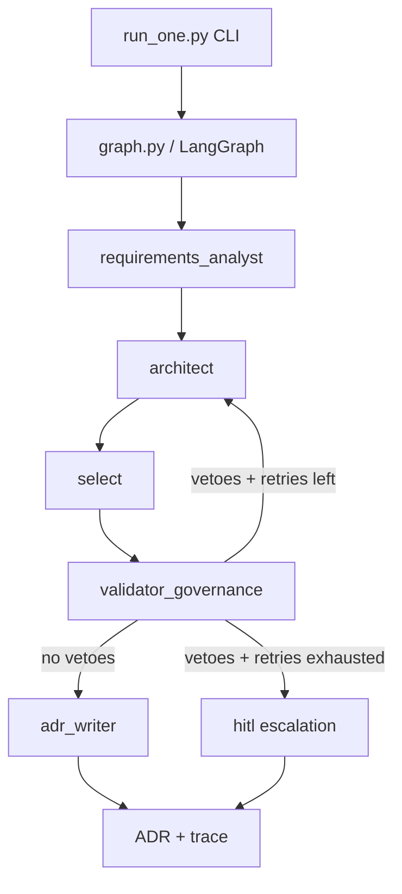

# AIV-DE -- AI Vision Decision Engine

A multi-agent system that generates auditable **Architecture Decision Records (ADRs)**
for AI-powered industrial vision deployments at factory sites.

Built with **LangGraph** (state machine orchestration), **Pydantic** (strict structured output),
and a deterministic governance layer (policy-as-code + physics validation).

---

## What it does in one run

**Input:** A factory site profile (power budget, latency, cameras, WAN, drift tolerance).

**Output:** An `ADR-001` markdown document + a `trace.json` audit log explaining how and why it decided.

---

## Architecture Overview



---

## Folder structure

```
aiv_de/
  data/               Ground-truth inputs (sites.json, hardware_specs.json)
  policy_store/       Governance-as-code (YAML policies)
  src/aiv_de/
    agents/           LLM-powered roles (requirements, architect, validator, ADR writer)
    tools/            Deterministic validators (feasibility, policy, hardware lookup)
    observability/    LLM logging with redaction + hashing
    graph.py          LangGraph orchestrator (state machine + SQLite checkpointing)
    run_one.py        CLI entry point
    config.py         Settings from .env
    types.py          Shared state schema (TypedDict)
  tests/              pytest test suite
```

---

## Setup

```powershell
cd aiv-de
python -m venv .venv
.\.venv\Scripts\Activate.ps1
pip install -r requirements.txt
copy .env.example .env       # add your OpenAI API key
```

---

## Demo

```powershell
$env:PYTHONPATH='src'

# Happy path -- ADR generated, no vetoes
python -m aiv_de.run_one DE-MUC-01

# Policy veto + HITL escalation (prompt injection in site docs)
python -m aiv_de.run_one POISON-12

# Feasibility veto + HITL escalation (impossible constraints)
python -m aiv_de.run_one IMPOSSIBLE-11
```

Outputs go to `out/`:
- `out/<site_id>_ADR-001.md`
- `out/<site_id>_trace.json`

---

## Tests

```powershell
$env:PYTHONPATH='src'
python -m pytest tests/ -v
```

---

## How it works

1. **Requirements Analyst** extracts constraints and assumptions from the site profile
2. **Architect** proposes 2-3 architecture options with strict Pydantic schema enforcement
   (includes a repair loop if the LLM output fails validation)
3. **Select** picks the top option (with hardware fallback if missing)
4. **Validator + Governance** runs deterministic checks:
   - Feasibility: power budget, latency vs cloud, multi-cam pressure
   - Policy: data residency, prompt injection detection
5. **Routing:**
   - No vetoes --> ADR writer produces the final document
   - Vetoes + retries left --> architect retries with veto feedback
   - Vetoes + retries exhausted --> HITL escalation
6. Every node logs `duration_s` and veto feedback into the trace for auditability

---

## Design principles

- **LLM proposes, tools dispose.** The LLM generates proposals; deterministic tools
  enforce physics constraints and governance policies.
- **Policy-as-code.** EU AI Act risk tiers, data residency, HITL triggers, and
  prompt injection patterns are defined in versioned YAML files.
- **Structured output.** The architect uses Pydantic models with `extra="forbid"` and
  a repair loop to ensure reliable JSON from the LLM.
- **Auditable traces.** Every run produces a JSON trace with per-node timing,
  veto reasons, and retry feedback.

---

## Adversarial test cases

| Site ID | Purpose |
|---------|---------|
| `POISON-12` | Contains prompt injection in `poison_doc` field. Policy checker detects it, vetoes, escalates to HITL. |
| `IMPOSSIBLE-11` | Contradictory constraints (20ms latency, 8W power, 16 cameras @ 60fps). Feasibility checker vetoes, exhausts retries, escalates. |

These exist to demonstrate that the system fails safely and escalates correctly.
