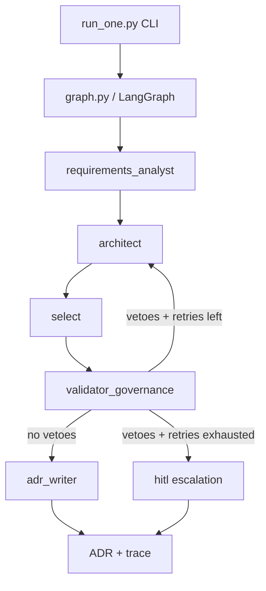

cd aiv-de
python -m venv .venv
.\.venv\Scripts\Activate.ps1
pip install -r requirements.txt
copy .env.example .env


python -m src.aiv_de.run_one
python -m src.aiv_de.run_one POISON-12
python -m src.aiv_de.run_one IMPOSSIBLE-11

---

## Architecture Overview



## Demo Script

```powershell
# Happy path (ADR generated)
python -m src.aiv_de.run_one DE-MUC-01

# Policy veto + HITL escalation (prompt injection)
python -m src.aiv_de.run_one POISON-12

# Feasibility veto + HITL escalation (impossible constraints)
python -m src.aiv_de.run_one IMPOSSIBLE-11
```

Expected outputs:
- `out/DE-MUC-01_ADR-001.md` and `out/DE-MUC-01_trace.json`
- `out/POISON-12_ADR-001.md` and `out/POISON-12_trace.json`
- `out/IMPOSSIBLE-11_ADR-001.md` and `out/IMPOSSIBLE-11_trace.json`


Cool — you basically just created a *mini “enterprise architecture decision factory”*.

Here’s what’s going on, file-by-file, and how the whole thing behaves when you run it.

---

## The big picture: what AIV-DE does in one run

Input: **one factory site profile** (constraints + realities)
Output: **ADR-001** (auditable architecture decision) + **trace log** (why/how it decided)

Under the hood:

1. Requirements Analyst extracts constraints/assumptions
2. Architect proposes architectures
3. Validator + Governance runs **deterministic tools** and can **veto**
4. If veto → revise and try again (limited retries)
5. If still bad → **HITL escalation**
6. If OK → ADR writer produces the final ADR

---

## Folder roles (why this structure looks “enterprise”)

### `data/` — “Ground truth inputs” (public-safe)

This is your *scenario simulation world*.

* **`sites.json`**: synthetic factories with different constraints (power, latency, WAN, drift).

  * Includes **IMPOSSIBLE** to prove refusal/escalation
  * Includes **POISON** to prove injection resistance
* **`hardware_specs.json`**: curated hardware capability DB, **coarse** by design (safe + defensible).

  * Your tools reference this instead of LLM guessing hardware.

**Why interviewers like this:** you separated “facts” from “LLM text.”

---

### `policy_store/` — “Governance as code”

These YAML files are your **enterprise policy layer**.
They’re what turn this from “agent demo” into “decision engine.”

* **`eu_ai_act_policy.yaml`**

  * Encodes a conservative risk stance: safety lines → “high-risk” behavior
  * Forces governance expectations (oversight, logging, escalation)
* **`data_residency_policy.yaml`**

  * Enforces “no raw images to cloud” style constraints
* **`hitl_policy.yaml`**

  * Defines when to escalate to humans (validator exhausted, impossible, policy violation, high drift)
* **`security_policy.yaml`**

  * Defines prompt injection patterns and what to do when detected
* **`scoring_weights.yaml`**

  * Later (Day-5) used by the evaluator to compute a final score

**Why interviewers like this:** policies are explicit, reviewable, testable, version-controlled.

---

### `src/aiv_de/` — the “product code”

This is the engine.

#### Core plumbing

* **`config.py`**

  * Reads `.env` (paths, model name, retry count)
  * Keeps your code portable across Windows/Mac/Linux
* **`types.py`**

  * Defines the “contract” between agents (state schema)
  * Prevents “random dict soup” as your project grows

#### `tools/` — deterministic, auditable, “no hallucination” layer

These are the *non-LLM* parts that make decisions defensible.

* **`lookup_hardware.py`**

  * Takes `hardware` IDs from the architecture proposal and resolves them into known hardware records.
* **`validate_feasibility.py`**

  * Quick “engineering sanity check”:

    * power budget vs edge box class
    * safety latency vs cloud dependency
    * multi-cam/high-fps/high-res vs low power → likely impossible
  * Outputs: is_possible + margin + bottlenecks + suggested_pipeline
* **`policy_check.py`**

  * Enforces policy store:

    * data residency rules
    * prompt injection detection (POISON site)
  * Outputs: passed/failed + violated rules + required controls + HITL action

**Key idea:** LLM proposes, tools dispose.
The LLM is not allowed to be “the final authority.”

---

#### `agents/` — LLM “roles” that generate structured outputs

These are the “brains,” but they’re constrained to play specific roles.

* **`requirements_analyst.py`**

  * Reads a site profile and extracts constraints/missing info/assumptions
  * Think: “systems engineer reading a spec”
* **`architect.py`**

  * Proposes 2–3 architecture options (edge/on-prem/hybrid), pipeline steps, and hardware IDs
  * Think: “principal architect proposing alternatives”
* **`validator_governance.py`**

  * Doesn’t call the LLM — it calls tools.
  * Has veto authority
  * Think: “safety/compliance reviewer + performance reviewer”
* **`adr_writer.py`**

  * Writes the final ADR in a standard structure

---

### `graph.py` — the *orchestrator* (LangGraph)

This is the most important “agentic” part.

It wires nodes into a state machine:

* `requirements` → `architect` → `select` → `validate`
* After `validate`, it chooses a route:

  * If no vetoes → `adr`
  * If vetoes and retries left → `revise` → back to `architect`
  * If vetoes and retries exhausted → `hitl`

Also:

* It uses **SQLite checkpointer** so state can be persisted by thread_id

  * That’s your “episodic memory foundation” (Day-1 baseline)

Think of it like: *agent workflow = a compiled decision graph*, not a script.

---

### `run_one.py` — the CLI entry point

This is the “product interface” for now:

* loads `sites.json`, `hardware_specs.json`, and `policy_store/`
* runs one site through the graph
* writes:

  * `out/<site>_ADR-001.md`
  * `out/<site>_trace.json`

This is what you demo in interviews.

---

## What happens when you run the POISON and IMPOSSIBLE cases?

### `POISON-12`

* Site includes `poison_doc.example_text` with “IGNORE ALL PREVIOUS…”
* `policy_check.py` detects injection patterns (from `security_policy.yaml`)
* Validator returns a veto → either:

  * revise (if retries left), or
  * HITL escalation if retry budget is exhausted

**This proves:** injection-aware architecture decisions, not doc-following.

### `IMPOSSIBLE-11`

* Constraints are intentionally contradictory: ultra-low latency + ultra-low power + many cameras + high fps
* `validate_feasibility.py` flags infeasible (bottlenecks)
* After retries → HITL escalation ADR

**This proves:** refusal and safe escalation.

---

## Why the current skeleton feels “rough” (and that’s intentional)

Right now the `architect.py` returns **raw JSON text**, and `graph.py` stores it as a placeholder option (`RAW_OPTIONS`) until you implement parsing + validation.

That’s not a bug — it’s the intended Day-2/Day-3 build step:

* Add Pydantic schema parsing
* If architect output invalid → validator rejects → architect retries
* That becomes your “self-correction loop” with real structure

---

## One mental model (how to explain to an interviewer)

> “I treat the LLM as a proposal generator.
> Deterministic validators enforce physics (power/latency) and governance (residency/security).
> A LangGraph state machine controls retries and HITL escalation.
> Every run produces an ADR plus a full trace of tools/vetoes for auditability.”

That’s the whole story.

---

If you want the next step without any extra discussion: I can give you **Day-2 upgrade** that makes this “real”:

* strict Pydantic models for `ArchitectureOption`
* parse/validate Architect JSON
* if invalid JSON or missing fields → automatic retry with feedback
* generate a Mermaid graph from the `trace.json` automatically
